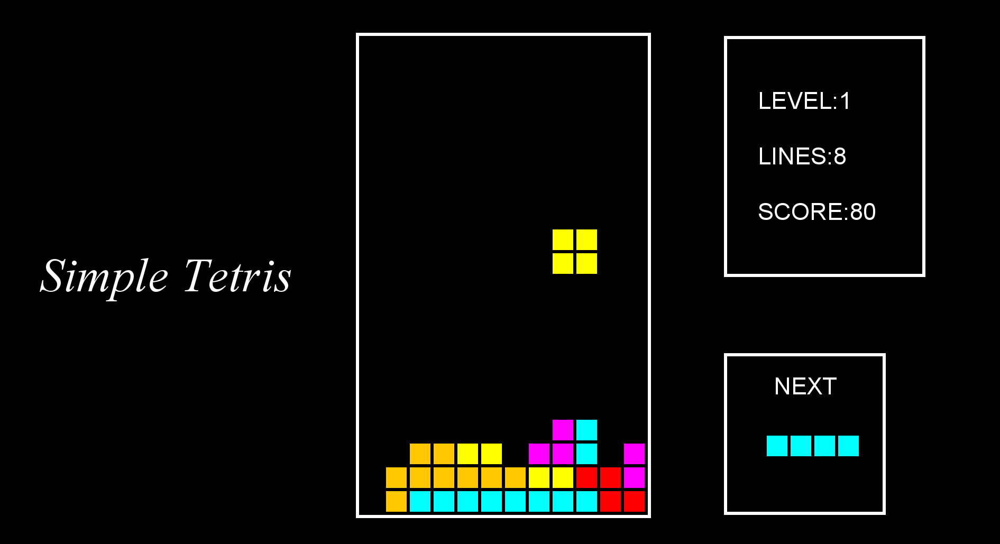

<h1 style="color: blue;">簡易版俄羅斯方塊 Tetris mini</h1>
  
<h2>🔴遊戲介紹及使用教學</h2> 
透過遊戲來增加自己對於寫coding的熱忱，藉此來學習更多知識及JAVA用法。未來希望能復刻TetrisBattle!

**遊戲分為10個等級，每當你消行一次，等級就會往上提升一階，速度(speed)也會隨之上升，快來挑戰你的極限吧!!**

操控方式很簡單：

W --> Change 變換方塊方向(未來會新增變換方塊) change

A --> Left 往左邊移動 

S --> Bottom 往下邊移動

D --> Right 往右邊移動

SPACE --> Paused 遊戲暫停

  
<h2 style="color: blue;">🔴遊戲介面 Tetris mini</h1>

